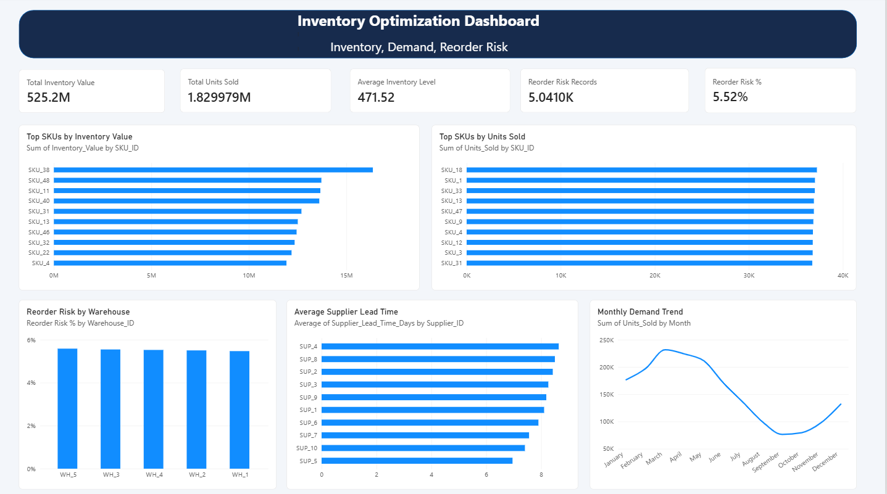

# Inventory Optimization Dashboard

## Project Overview

An inventory analytics project designed to evaluate inventory levels, product demand, inventory turnover, supplier lead times and reorder risk. The project uses Python for data cleaning and exploratory analysis, MySQL for business analysis and Power BI for interactive visualization.

## Business Objectives

* Identify products with high inventory value and sales volume.
* Monitor products that fall at or below their reorder points.
* Compare inventory performance across warehouses and regions.
* Evaluate supplier lead times and their relationship with reorder risk.
* Assess demand forecast accuracy and inventory turnover.

## Tools and Technologies

* **Python:** Pandas, NumPy, Matplotlib, Seaborn
* **SQL:** MySQL
* **Visualization:** Microsoft Power BI, DAX
* **Development:** Jupyter Notebook, VS Code, Git, GitHub

## Dataset

The dataset contains daily supply-chain inventory records from 2024, including SKU, warehouse, supplier, region, units sold, inventory levels, unit costs, lead times, reorder points and demand forecasts.

The data was checked for duplicate records, missing values and invalid dates before analysis. Additional analytical fields were created, including inventory value, unit margin, demand variance and reorder risk.

## Key Performance Indicators

| KPI                                       |    Result |
| ----------------------------------------- | --------: |
| Total units sold                          | 1,829,979 |
| Average inventory level                   |    471.52 |
| Reorder-risk records                      |     5,041 |
| Reorder-risk percentage                   |     5.52% |
| Forecast Mean Absolute Error (MAE)        |      2.38 |
| Weighted Absolute Percentage Error (WAPE) |    11.87% |

**Note:** Total recorded inventory value across daily observations was 525,243,991.12. This is a cumulative sum of daily inventory-value observations, not a single point-in-time inventory balance.

## Key Findings

* SKU_38 had the highest cumulative recorded inventory value among SKUs.
* SKU_18 recorded the highest total units sold.
* SKU_20 and SKU_14 had the highest observed SKU-level reorder-risk percentages.
* Reorder risk varied across warehouses and regions.
* Supplier lead time showed a positive correlation with reorder risk in the exploratory analysis.
* Forecast evaluation produced an MAE of 2.38 and WAPE of 11.87%.

## Dashboard Preview



The Power BI report includes KPI cards, SKU inventory-value and sales comparisons, monthly demand trends, warehouse reorder-risk analysis and supplier lead-time comparisons.

## Project Structure

```text
Inventory_Optimization_Dashboard/
├──.venv/
├── data/
│   ├── supply_chain_dataset1.csv
│   └── inventory_cleaned.csv
├── images/
│   └── inventory_dashboard.png
├── Notebooks/
│   ├── 01_Data_Inspection.ipynb
│   └──02_Exploratory_Data_Analysis.ipynb
│   
├── powerbi/
│   └── Inventory_Optimization_Dashboard.pbix
├── scripts/
│   └── load_data_to_mysql.py
├── sql/
│   └── 01_inventory_analysis.sql
└── README.md
```

## Limitations

* The dataset's `Stockout_Flag` contains only zero values, so actual stockout events could not be evaluated using that field.
* Reorder risk is defined as inventory level less than or equal to the reorder point.
* Inventory-value totals across daily records should not be interpreted as a single-date inventory balance.

## Conclusion

This project demonstrates an end-to-end analytics workflow involving data preparation, exploratory analysis, SQL querying, KPI development and Power BI reporting to support inventory and supply-chain decisions.
